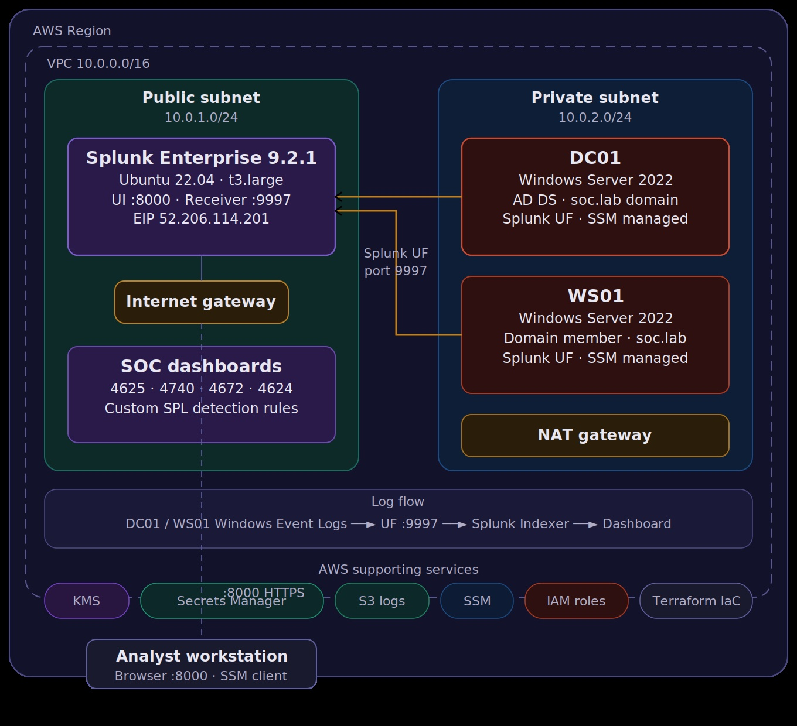

<div align="center">

# AWS SOC Lab

### Terraform IaC · Splunk Enterprise · Active Directory · Red Team Simulations

*A production-grade Security Operations Center deployed entirely via infrastructure-as-code on AWS —
log aggregation, real-time threat detection, and adversary simulation in a fully isolated cloud environment.*

<br>

[](https://terraform.io)
[](https://aws.amazon.com)
[](https://splunk.com)
[]()
[]()
[]()

</div>

---

## Table of Contents

- [Overview](#overview)
- [Architecture](#architecture)
- [Tech Stack](#tech-stack)
- [Prerequisites](#prerequisites)
- [Deployment](#deployment)
- [Access Guide](#access-guide)
- [Attack Simulations](#attack-simulations)
- [MITRE ATT&CK Coverage](#mitre-attck-coverage)
- [SOC Dashboard](#soc-dashboard)
- [Security Controls](#security-controls)
- [Project Structure](#project-structure)
- [Cost & Cleanup](#cost--cleanup)
- [Author](#author)

---

## Overview

This lab replicates a real enterprise Security Operations Center environment — provisioned from scratch using Terraform, requiring zero manual configuration. It exists to develop and demonstrate depth in:

- **SIEM engineering** — Splunk Enterprise with production-style indexes, forwarder management, and custom detection dashboards
- **Log pipeline architecture** — Universal Forwarders shipping Windows Security, System, and Application event logs from a live Active Directory domain to a centralized indexer
- **Threat detection** — Pattern-based SPL queries identifying brute force, account lockout, privilege escalation, and lateral movement in real time
- **Cloud security posture** — KMS encryption at rest, Secrets Manager credential vaulting, SSM-only instance access with zero open ports to the internet
- **Adversary simulation** — PowerShell attack scripts that generate authentic Windows event telemetry for blue team analysis and tuning

Everything is codified, repeatable, and fully destroyable. No ClickOps. No drift.

---

## Architecture

<div align="center">



*Figure 1 — Full lab topology. Splunk Enterprise (public subnet) ingests Windows event logs from DC01 and WS01 (private subnet) via Universal Forwarder on port 9997. All instance access is brokered exclusively through AWS SSM Session Manager.*

</div>

**Log flow:**

```
DC01 (Windows Event Log)  ──►  Splunk UF :9997  ──►  Splunk Indexer  ──►  SOC Dashboard
WS01 (Windows Event Log)  ──►  Splunk UF :9997  ──┘
```

**Network summary:**

| Component | Subnet | CIDR | Access |
|---|---|---|---|
| Splunk Enterprise | Public | 10.0.1.0/24 | EIP + IGW · Port 8000 restricted to analyst IP |
| DC01 (AD DS) | Private | 10.0.2.0/24 | SSM only · No inbound internet |
| WS01 (Member) | Private | 10.0.2.0/24 | SSM only · No inbound internet |
| NAT Gateway | Public | 10.0.1.0/24 | Outbound-only for private subnet |

---

## Tech Stack

| Category | Technology | Notes |
|---|---|---|
| Infrastructure as Code | Terraform >= 1.5 | Multi-file, multi-resource |
| Cloud Platform | AWS | EC2, VPC, KMS, Secrets Manager, S3, IAM, SSM, NAT Gateway |
| SIEM | Splunk Enterprise 9.2.1 | `t3.large` · Ubuntu 22.04 |
| Log Shipping | Splunk Universal Forwarder | Deployed on both Windows hosts |
| Domain Controller | Windows Server 2022 | AD DS · `soc.lab` domain |
| Domain Endpoint | Windows Server 2022 | Domain-joined workstation |
| Attack Simulation | PowerShell | 4 scripts covering the kill chain |

---

## Prerequisites

**Required tooling:**

```bash
terraform  >= 1.5.0
aws-cli    >= 2.x       # Configured with appropriate IAM permissions
```

**AWS IAM permissions required:**

| Service | Required Actions |
|---|---|
| EC2 | Full — instances, VPC, security groups, key pairs, EIP |
| KMS | `CreateKey` `Encrypt` `Decrypt` `GenerateDataKey` |
| Secrets Manager | `CreateSecret` `GetSecretValue` `PutSecretValue` |
| S3 | `CreateBucket` `PutObject` `GetObject` `PutBucketEncryption` |
| SSM | `StartSession` `SendCommand` `DescribeInstanceInformation` |
| IAM | `CreateRole` `AttachRolePolicy` `CreateInstanceProfile` `PassRole` |

**Configure the AWS CLI:**

```bash
aws configure
# AWS Access Key ID:     <your key>
# AWS Secret Access Key: <your secret>
# Default region:        us-east-1
# Output format:         json
```

---

## Deployment

### 1 · Clone the repository

```bash
git clone https://github.com/Cybersec120/soc-lab.git
cd soc-lab
```

### 2 · Configure variables

```bash
cp terraform.tfvars.example terraform.tfvars
```

Edit `terraform.tfvars`:

```hcl
aws_region            = "us-east-1"
environment           = "soc-lab"
splunk_instance_type  = "t3.large"
windows_instance_type = "t3.medium"
allowed_ip            = "<your-public-ip>/32"   # Restricts Splunk UI to your IP only
```

### 3 · Initialize Terraform

```bash
terraform init
```

### 4 · Review the plan

```bash
terraform plan -out=tfplan
```

### 5 · Deploy

```bash
terraform apply tfplan
```

> ⏱️ **Estimated deployment time: 12–18 minutes.**
> Terraform will provision VPC networking, launch EC2 instances, promote DC01 as a domain controller, join WS01 to `soc.lab`, install Splunk Enterprise, and deploy Universal Forwarders — all via user data automation.

### 6 · Capture outputs

```bash
terraform output
```

```
splunk_public_ip   = "52.206.114.201"
splunk_url         = "http://52.206.114.201:8000"
dc01_instance_id   = "i-0abc123..."
ws01_instance_id   = "i-0def456..."
kms_key_arn        = "arn:aws:kms:us-east-1:..."
```

---

## Access Guide

### Splunk Web UI

```
http://<splunk_public_ip>:8000
```

Retrieve credentials from Secrets Manager:

```bash
# Splunk admin password
aws secretsmanager get-secret-value \
  --secret-id soc-lab/splunk/admin \
  --query SecretString \
  --output text

# Windows domain administrator password
aws secretsmanager get-secret-value \
  --secret-id soc-lab/windows/admin \
  --query SecretString \
  --output text
```

### Shell access to Splunk (no port 22 open)

```bash
aws ssm start-session --target <splunk_instance_id>
```

### RDP to Windows hosts (via SSM port forwarding — no port 3389 open)

```bash
# Forward local port 13389 → DC01 port 3389
aws ssm start-session \
  --target <dc01_instance_id> \
  --document-name AWS-StartPortForwardingSession \
  --parameters '{"portNumber":["3389"],"localPortNumber":["13389"]}'

# Connect RDP client to: localhost:13389
# Domain: soc.lab  |  User: Administrator
```

---

## Attack Simulations

All scripts are located in `attack-simulations/`. Each script generates specific Windows Security Event Log telemetry designed for blue team detection and tuning exercises.

> **⚠️ These scripts are designed for authorized use within this isolated lab environment only.**

Connect to a Windows host before running simulations:

```bash
aws ssm start-session --target <ws01_instance_id>
```

---

### Simulation 01 — Brute Force

```powershell
.\attack-simulations\01_brute_force.ps1
```

Floods authentication endpoints with failed login attempts against local and domain accounts, simulating credential stuffing or password spraying behavior.

**Events generated:** `4625` (Failed Logon)

**SPL detection:**
```spl
index=windows EventCode=4625
| stats count by src_ip, user
| where count > 10
| sort -count
```

---

### Simulation 02 — Account Lockout

```powershell
.\attack-simulations\02_account_lockout.ps1
```

Triggers domain account lockout policies by exceeding the threshold of failed authentications, surfacing lockout source attribution data on the domain controller.

**Events generated:** `4740` (Account Locked Out)

**SPL detection:**
```spl
index=windows EventCode=4740
| table _time, user, src, ComputerName
| sort -_time
```

---

### Simulation 03 — Privilege Escalation

```powershell
.\attack-simulations\03_privilege_escalation.ps1
```

Adds a user to privileged local and domain groups, generating sensitive privilege assignment events and group membership modification logs.

**Events generated:** `4672` `4728` `4732`

**SPL detection:**
```spl
index=windows (EventCode=4728 OR EventCode=4732 OR EventCode=4672)
| eval action=case(
    EventCode==4728, "Added to Global Group",
    EventCode==4732, "Added to Local Group",
    EventCode==4672, "Special Privileges Assigned")
| table _time, user, action, ComputerName
```

---

### Simulation 04 — Lateral Movement

```powershell
.\attack-simulations\04_lateral_movement.ps1
```

Simulates pass-the-hash and explicit credential reuse patterns across hosts, generating network logon events consistent with post-exploitation lateral movement tradecraft.

**Events generated:** `4624` (Logon Type 3) · `4648` (Explicit Credentials)

**SPL detection:**
```spl
index=windows EventCode=4624 Logon_Type=3
| stats count by src_ip, user, ComputerName
| where count > 3
| sort -count
```

---

### Full kill chain execution

```powershell
$scripts = @(
    ".\attack-simulations\01_brute_force.ps1",
    ".\attack-simulations\02_account_lockout.ps1",
    ".\attack-simulations\03_privilege_escalation.ps1",
    ".\attack-simulations\04_lateral_movement.ps1"
)
foreach ($s in $scripts) { & $s; Start-Sleep -Seconds 5 }
```

---

## MITRE ATT&CK Coverage

| Simulation | Tactic | Technique | ID |
|---|---|---|---|
| Brute Force | Credential Access | Brute Force | T1110 |
| Account Lockout | Credential Access | Brute Force: Password Spraying | T1110.003 |
| Privilege Escalation | Privilege Escalation | Valid Accounts | T1078 |
| Lateral Movement | Lateral Movement | Remote Services | T1021 |
| Lateral Movement | Privilege Escalation | Access Token Manipulation | T1134 |

---

## SOC Dashboard

The pre-built dashboard XML is at `soc_dashboard.xml`.

### Import via Splunk UI

1. Log in at `http://<splunk_ip>:8000`
2. Go to **Search & Reporting → Dashboards → Create New Dashboard**
3. Select **Classic Dashboard** and click **Source** (top-right toggle)
4. Paste the contents of `soc_dashboard.xml` and click **Save**

### Import via REST API

```bash
SPLUNK_IP="52.206.114.201"
SPLUNK_PASS=$(aws secretsmanager get-secret-value \
  --secret-id soc-lab/splunk/admin \
  --query SecretString --output text)

curl -k -u admin:$SPLUNK_PASS \
  https://$SPLUNK_IP:8089/servicesNS/admin/search/data/ui/views \
  -d "name=soc_lab_dashboard" \
  --data-urlencode "eai:data@soc_dashboard.xml"
```

### Dashboard panels

| Panel | Event IDs | Purpose |
|---|---|---|
| Failed Logons Over Time | 4625 | Brute force trend visualization |
| Top Locked-Out Accounts | 4740 | Lockout frequency by account |
| Privilege Escalation Events | 4672 · 4728 · 4732 | Sensitive group and privilege changes |
| Lateral Movement Heatmap | 4624 (Type 3) · 4648 | Cross-host authentication patterns |
| Top Attack Source IPs | 4625 · 4648 | Attack origin ranking |
| Live Security Event Feed | All | Real-time event stream |

---

## Security Controls

| Control | Implementation |
|---|---|
| Encryption at rest | KMS CMK applied to all EBS volumes and S3 buckets |
| Secrets management | All credentials stored in AWS Secrets Manager — never plaintext in Terraform state |
| Zero exposed management ports | All access via SSM Session Manager — ports 22 and 3389 are closed to the internet |
| Least-privilege IAM | Separate scoped instance profiles for Splunk and Windows hosts |
| Network isolation | Windows hosts in private subnet with no direct internet exposure; outbound via NAT Gateway only |
| Ingress restriction | Splunk UI port 8000 restricted to analyst IP via security group; UF port 9997 restricted to VPC CIDR |

---

## Project Structure

```
soc-lab/
├── providers.tf                     # AWS provider configuration and backend
├── variables.tf                     # Input variable declarations
├── terraform.tfvars                 # Environment-specific values (gitignored)
├── terraform.tfvars.example         # Template for required variables
├── main.tf                          # VPC, KMS, Secrets Manager, Security Groups
├── splunk.tf                        # Splunk EC2, IAM role, S3, Elastic IP, user data
├── windows.tf                       # DC01, WS01, IAM roles, AD provisioning via user data
├── outputs.tf                       # Splunk URL, instance IDs, KMS key ARN
├── soc_dashboard.xml                # Pre-built Splunk SOC dashboard
├── soc_lab_architecture.jpg         # Architecture diagram
└── attack-simulations/
    ├── 01_brute_force.ps1           # Failed logon flood          — EventCode 4625
    ├── 02_account_lockout.ps1       # Account lockout trigger     — EventCode 4740
    ├── 03_privilege_escalation.ps1  # Group membership abuse      — EventCode 4672/4728/4732
    └── 04_lateral_movement.ps1      # Network logon / pass-hash   — EventCode 4624/4648
```

> **Note:** `terraform.tfvars` is gitignored. Copy `terraform.tfvars.example` and populate before deploying.

---

## Cost & Cleanup

**Estimated cost while running:**

| Instance | Type | $/hr (us-east-1) |
|---|---|---|
| Splunk (Ubuntu) | t3.large | ~$0.083 |
| DC01 (Windows) | t3.medium | ~$0.070 |
| WS01 (Windows) | t3.medium | ~$0.070 |
| NAT Gateway | — | ~$0.045 + data |

> **~$8–12/day fully running.** Destroy the lab when not in use.

**Tear down all resources:**

```bash
terraform destroy
```

> 💡 For longer-term labs, consider an EC2 Instance Scheduler to automate stop/start on a defined window.

---

## Author

<div align="center">

**A.W. F. Shabazz El**
<br>
*Cloud Architect & Security Consultant*
<br><br>

AWS Certified Solutions Architect &nbsp;·&nbsp; Azure Security Engineer &nbsp;·&nbsp; OSCP &nbsp;·&nbsp; CKA &nbsp;·&nbsp; Terraform Associate

<br>

[](https://github.com/Cybersec120)

<br>

---

*Built with purpose. Documented with precision. Deployed with code.*

</div>
